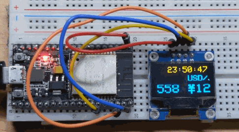
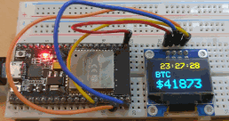
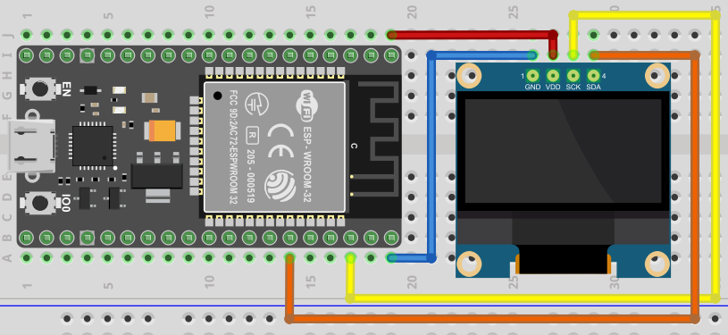

# ESP32-BTC
Simple Demo for an ESP32 module with a TFT LCD or an OLED display.

Forked from https://github.com/joysfera/esp32-btc

1. Change from BTC acquisition time to current real time.
2. Change time zone to JST(+9h).

3. When acquse the BTC, blink the blue LED on GPIO 02 & invert screen on esp32s GPIO 02.
4. Scrolled clock and price display to prevent OLED burn-in.
5. Add USD/JPY price.

Displays current real time and BTC price in USD.

## install (The result I tried)
1. Prepare the parts.

   ESP32-S(Node-MCU/Hiletgo) 
   
   0.96" I2C serial 128×64 OLED LCD (SSD1306)
   
   Wire & Pret board
   
2. Wiring following below

3. Insert Wi-fi SSID & Password in .ino file

4. Compile arduino IDE & write down ESP-32.

   Requirement: Arduino core for the ESP32 2.0.2
   Tested boards: ESP32 DevModule, NODE32S,
   

   You may need to press and hold the Boot button when writing to the ESP32.

5. Just run!

